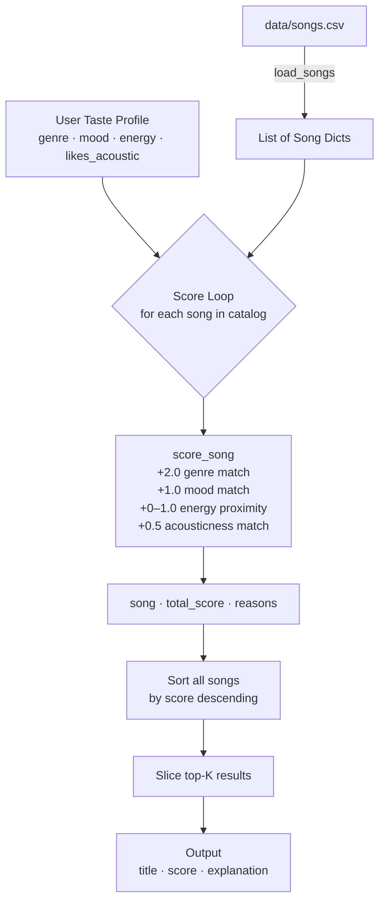

# 🎵 Music Recommender Simulation

## Project Summary

In this project you will build and explain a small music recommender system.

Your goal is to:

- Represent songs and a user "taste profile" as data
- Design a scoring rule that turns that data into recommendations
- Evaluate what your system gets right and wrong
- Reflect on how this mirrors real world AI recommenders

This version scores each song against a user's taste profile using a weighted formula across five features: genre match, mood match, energy proximity, acousticness preference, and tempo proximity. Numerical features like energy and tempo are scored using a proximity penalty — rewarding songs that are close to the user's target, not just songs with high or low values. The top-k songs are then ranked by their final score and returned with a plain-language explanation of why each one was recommended.

---

## How The System Works

Each `Song` stores: `genre`, `mood`, `energy`, `tempo_bpm`, `valence`, `danceability`, `acousticness`.

The `UserProfile` stores: `favorite_genre`, `favorite_mood`, `target_energy`, `likes_acoustic`.

Scoring recipe (max score = 4.5):

| Rule | Points |
|---|---|
| Genre match | +2.0 |
| Mood match | +1.0 |
| Energy proximity `1.0 - \|song.energy - target\|` | +0.0 – 1.0 |
| Acousticness preference match | +0.5 |

The top-k songs by score are returned with a plain-language explanation.

### Data Flow



---

## Getting Started

### Setup

1. Create a virtual environment (optional but recommended):

   ```bash
   python -m venv .venv
   source .venv/bin/activate      # Mac or Linux
   .venv\Scripts\activate         # Windows

2. Install dependencies

```bash
pip install -r requirements.txt
```

3. Run the app:

```bash
python -m src.main
```

### Running Tests

Run the starter tests with:

```bash
pytest
```

You can add more tests in `tests/test_recommender.py`.

---

## Experiments You Tried

**Experiment 1 — Five distinct user profiles**

I ran the recommender against three standard profiles (High-Energy Pop, Chill Lofi, Deep Intense Rock) and two adversarial ones. The standard profiles all returned results that felt right — *Sunrise City* topped the pop list, *Library Rain* topped the lofi list, and *Storm Runner* nearly maxed out the rock list at 4.49/4.5. The system clearly works when the user's preferences align cleanly with songs in the catalog.

**Experiment 2 — Conflicting preferences (adversarial)**

I tested a profile with `genre: blues`, `mood: sad`, but `energy: 0.90` — intentionally high energy for a low-energy genre. *Blue Porch Rain* (energy 0.44) still ranked #1 because genre + mood = 3.0 points, which overpowered the energy gap. This showed that the genre weight is strong enough to ignore what the user said about energy. The system essentially told a user who wanted "sad but intense" that they were getting quiet blues regardless.

**Experiment 3 — Genre not in catalog (cold start)**

Setting `genre: "edm"` meant no song could ever earn the +2.0 genre bonus. The maximum achievable score dropped from 4.5 to ~2.5. The system still returned reasonable fallback results based on mood and energy, but there was no way for the user to know their main preference was being ignored entirely.

**Experiment 4 — Doubled energy weight**

I changed the weights to `genre: 1.0, energy: 2.0` for the High-Energy Pop profile. *Rooftop Lights* jumped from 2.41 to 3.32 and almost tied *Gym Hero* (3.34) — a cross-genre song with a similar mood gained a full point just from energy proximity. Doubling energy made the results more diverse by letting non-genre songs compete more fairly, but it also weakened the signal for users whose genre really is their most important preference.

---

## Limitations and Risks

- **The catalog is tiny.** With only 18 songs and 1–2 per genre, genre matching almost always locks in a single predictable top result. A real system would need thousands of songs before the other features (energy, mood, acousticness) could meaningfully differentiate results.
- **The system cannot handle conflicting preferences.** If a user wants a high-energy sad song, the genre and mood weights will always win over the energy signal. There is no way to express "this feeling matters more than that one."
- **Three features stored in every song are never used.** Tempo, valence, and danceability appear in the CSV but are invisible to the scoring function. A user who cares about those dimensions gets no benefit from them.
- **Genre is a single exact string match.** A user who likes both rock and metal gets credit for neither unless the string matches perfectly. There is no concept of similar or adjacent genres.
- **The system does not learn.** It has no memory of past recommendations, no way to track what a user skipped or replayed, and no mechanism to improve over time.

---

## Reflection

[**Model Card**](model_card.md)

Building this recommender made me realize that the interesting challenge is not the code — it is deciding *what to measure and how much it should matter*. Choosing the weights (genre = 2.0, mood = 1.0, energy up to 1.0) felt straightforward at first, but running the adversarial profiles showed how quickly those choices break down. A "high energy + sad" user got a quiet blues track as their top recommendation because genre and mood math outweighed the energy gap. The system was technically doing exactly what I told it to do, just not what the user actually wanted. That gap between "correct by the formula" and "right for the person" is probably the hardest problem in recommendation.

It also gave me a new way to think about apps like Spotify. When Spotify knows I keep skipping certain artists or replaying certain songs, it is essentially adjusting weights based on my behavior — doing automatically what I had to do manually here. The fact that I had to *guess* the right weights, and that different profiles needed different weights to feel accurate, makes clear why learning from behavior is so powerful. The human judgment that still matters most is deciding which behaviors to track and what they should mean. An algorithm that learns from skips assumes a skip means dislike — but sometimes you skip a song because you are in the wrong mood, not because you hate it. That kind of nuance is something the model cannot figure out on its own.

